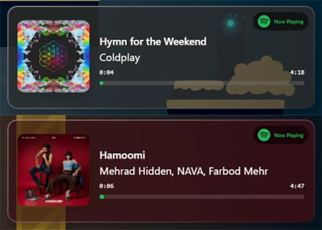

# Spotify OBS Overlay

A beautiful, customizable Spotify overlay for OBS Studio that displays your currently playing track in real-time with stunning animations and dynamic styling.


## Demo Video

Watch the Spotify OBS Overlay in action with default settings on OBS Studio:

<div align="center">
  <video width="800" controls>
    <source src="./demo/demo-in-stream.mp4" type="video/mp4">
    Your browser does not support the video tag.
  </video>
</div>

📹 **Direct link**: [Watch on GitHub](./demo/demo-in-stream.mp4)

### In-Stream Preview

<div align="center">
  
</div>

## Prerequisites

- Node.js (v14 or higher)
- A Spotify Account
- OBS Studio (for using the overlay)

## Installation

1. **Clone the repository**
   ```bash
   git clone https://github.com/DrSaeedHub/OBS-Spotify-Overlay.git
   cd OBS-Spotify-Overlay
   ```

2. **Install dependencies**
   ```bash
   npm install
   ```

3. **Set up environment variables**
   
   Create a `.env` file in the root directory:
   ```env
   SPOTIFY_CLIENT_ID=your_spotify_client_id_here
   SPOTIFY_CLIENT_SECRET=your_spotify_client_secret_here
   BASE_URL=http://localhost:3000
   REDIRECT_URI=http://localhost:3000/auth/callback
   PORT=3000
   ```

## Spotify API Setup

1. Go to [Spotify Developer Dashboard](https://developer.spotify.com/dashboard)
2. Click **"Create App"**
3. Fill in the app details:
   - **App name**: Your app name
   - **Description**: Spotify OBS Overlay
   - **Website**: `http://localhost:3000`
   - **Redirect URI**: `http://localhost:3000/auth/callback`
4. Click **"Add"** and save
5. Copy your **Client ID** and add it to your `.env` file
6. Click **"Settings"** in your app
7. Under **"Redirect URIs"**, add: `http://localhost:3000/auth/callback`

## Running the Application

1. **Start the server**
   ```bash
   npm start
   ```

2. **Open your browser**
   ```
   http://localhost:3000
   ```

3. **Login with Spotify**
   - Click "Login with Spotify"
   - Authorize the application
   - You'll be redirected back to the dashboard

## Usage in OBS

1. **Get Your Widget URL**
   - After logging in, you'll see your unique widget URL
   - Click the "Copy" button to copy it
   - Keep the full URL (including anything after `#`)

2. **Add to OBS**
   - Open OBS Studio
   - Click the **"+"** button in Sources
   - Select **"Browser Source"**
   - Click **"OK"** without entering anything
   - In the Properties dialog:
     - **URL**: Paste your widget URL
     - **Width**: 800px
     - **Height**: 600px
     - Enable **"Shutdown source when not visible"**
     - Enable **"Refresh browser when scene becomes active"**
   - Click **"OK"**

3. **Position and Customize**
   - Move and resize the overlay as needed
   - Return to the web interface to customize appearance

## Customization

### Basic Settings

- **Show/Hide Elements**: Toggle visibility of song name, artist, progress bar, Spotify badge, and album cover
- **Widget Styles**: Choose between Default, Horizontal, and Retro themes

### Advanced Settings

#### Background Options
- **Transparent** - No background
- **Solid Color** - Customizable color and opacity
- **Liquid Glass** - Glassmorphism effect with blur and tinting

#### Text Customization
- **Text Color** - Customize song and artist text colors
- **Text Shadow** - Add depth with customizable shadows
- **Text Glow** - Add a glowing effect to the text
- **Use Track Colors** - Automatically apply dominant colors from album artwork

#### Border Settings
- **Enable Border** - Add a border around the widget
- **Border Styles**:
  - **Solid** - Single color border
  - **Gradient** - Two-color gradient border

#### Accent Color Integration
Enable "Use Track Color" for any element to automatically apply the dominant color from the current album artwork:
- Background
- Glass tint
- Text color
- Shadow color
- Glow color
- Border colors

<div align="center">
  
  <p><em>The overlay automatically extracts and applies colors from album artwork for dynamic, vibrant styling</em></p>
</div>

## How It Works

1. **Authentication**: Uses Spotify OAuth 2.0 with PKCE (Proof Key for Code Exchange) for secure authentication
2. **Real-time Updates**: Polls Spotify API every 10 seconds by default (`refreshSeconds` or `refreshMs` URL params to change it)
3. **Dynamic Theming**: Extracts dominant colors from album artwork using the ColorThief library
4. **Progress Tracking**: Local progress calculation based on API timestamps (smooth progress between API polls)
5. **Token Management**: Automatic token refresh before expiration
6. **Pause/Idle Behavior**: Pausing freezes the progress bar and auto-hides the widget after 5 seconds (configurable via `hideOnPause` + `pauseHideSeconds`/`pauseHideMs`)

## API Endpoints

- `GET /auth/login` - Initiates OAuth flow
- `GET /auth/callback` - OAuth callback handler
- `GET /api/current-track` - Fetches currently playing track
- `POST /api/refresh-token` - Refreshes access token

## Project Structure

```
OBS-Spotify-Overlay/
├── public/
│   ├── app.js          # Login page logic
│   ├── widget.js         # Widget display logic
│   ├── index.html      # Main dashboard
│   ├── widget.html     # Widget overlay
│   └── styles.css      # All styling
├── server.js           # Express server
├── package.json        # Dependencies
└── README.md          # This file
```

## Troubleshooting

### Widget not updating
- Make sure Spotify is playing a track
- Check that the browser source in OBS isn't paused
- Verify your internet connection

### "Session expired" error
- Click "Disconnect Spotify" and log in again
- Check that your refresh token is valid

### Widget not showing
- Verify the URL is correct in OBS
- Check that the server is running (`npm start`)
- Ensure the browser source size matches (800x600 for default)

## Deployment (Free Hosting Options)

### Option 1: Render (Recommended)

[Render](https://render.com) offers free hosting for web services with automatic HTTPS.

**Steps to deploy:**
1. Push your code to GitHub
2. Sign up at [render.com](https://render.com) (free with GitHub)
3. Click **"New +"** → **"Web Service"**
4. Connect your GitHub repository
5. Configure the service:
   - **Name**: spotify-obs-overlay (or any name)
   - **Environment**: Node
   - **Build Command**: `npm install`
   - **Start Command**: `npm start`
   6. Go to **"Environment"** tab and add:
   - `BASE_URL` - https://your-app-name.onrender.com
   - `SPOTIFY_CLIENT_ID` - Your Spotify Client ID
   - `SPOTIFY_CLIENT_SECRET` - Optional (not required for PKCE)
   - `REDIRECT_URI` - https://your-app-name.onrender.com/auth/callback
   - `PORT` - Leave empty (Render sets it automatically)
7. Click **"Create Web Service"**
8. Once deployed, update your Spotify app's Redirect URI to: `https://your-app-name.onrender.com/auth/callback`
9. Your site will be available at: `https://your-app-name.onrender.com`

**Important Notes:**
- Free tier may spin down after 15 minutes of inactivity (services auto-wake on requests)
- First request after spin-down can take 30-60 seconds
- Your OBS overlay URL is shown on the dashboard after login (copy/paste it into OBS and keep the full URL, including anything after `#`)

### Option 2: Fly.io

[Fly.io](https://fly.io) offers free hosting with fast cold starts.

**Steps to deploy:**
1. Install Fly CLI: https://fly.io/docs/getting-started/installing-flyctl/
2. Run in your project: `fly launch`
3. Follow prompts, select your region
4. Set environment variables:
   ```bash
   fly secrets set BASE_URL=https://your-app.fly.dev
   fly secrets set SPOTIFY_CLIENT_ID=your_client_id
   fly secrets set REDIRECT_URI=https://your-app.fly.dev/auth/callback
   ```
5. Deploy: `fly deploy`
6. Your site will be at: `https://your-app.fly.dev`

### Option 3: Railway

[Railway](https://railway.app) offers $5/month free credit (enough for light usage).

**Steps to deploy:**
1. Sign up at [railway.app](https://railway.app)
2. Click **"New Project"** → **"Deploy from GitHub repo"**
3. Connect your repository
4. Railway auto-detects Node.js projects
5. Add environment variables in the dashboard:
   - `BASE_URL` - https://your-app-name.up.railway.app
   - `SPOTIFY_CLIENT_ID` - Your Spotify Client ID
   - `REDIRECT_URI` - https://your-app-name.up.railway.app/auth/callback
6. Deploy automatically happens on push to main

### Option 4: Heroku

[Heroku](https://heroku.com) offers free dynos with limitations.

**Steps to deploy:**
1. Install Heroku CLI: https://devcenter.heroku.com/articles/heroku-cli
2. Login: `heroku login`
3. Create app: `heroku create your-app-name`
4. Set environment variables:
   ```bash
   heroku config:set BASE_URL=https://your-app-name.herokuapp.com
   heroku config:set SPOTIFY_CLIENT_ID=your_client_id
   heroku config:set REDIRECT_URI=https://your-app-name.herokuapp.com/auth/callback
   ```
5. Deploy: `git push heroku main`
6. Your site will be at: `https://your-app-name.herokuapp.com`

### Important: Update Spotify App Settings

After deploying, update your [Spotify Developer Dashboard](https://developer.spotify.com/dashboard):

1. Go to your app settings
2. Under **"Redirect URIs"**, add your deployed URL:
   - Render: `https://your-app-name.onrender.com/auth/callback`
   - Fly.io: `https://your-app-name.fly.dev/auth/callback`
   - Railway: `https://your-app-name.up.railway.app/auth/callback`
   - Heroku: `https://your-app-name.herokuapp.com/auth/callback`
3. Save changes

### Accessing Your Deployed Overlay

Once deployed, get your widget URL for OBS:
- Go to `https://your-deployed-url.com`
- Log in with Spotify
- Copy your unique widget URL
- Keep the full URL (including anything after `#`)
- Add it as a Browser Source in OBS

## Development

### Running in Development Mode

```bash
npm start
```

The server will run on `http://localhost:3000`

### Adding New Styles

1. Add a new class to `styles.css` (e.g., `.widget-container.your-style`)
2. Add a style option in `index.html`
3. Update `selectStyle()` function in `app.js`

## Security Notes

- Tokens are handled client-side (URL hash for OBS/incognito support, localStorage when available); the server does not store user tokens
- The server only acts as a proxy to avoid CORS issues
- Never commit your `.env` file with credentials
- The application uses HTTPS-ready redirect URIs

## Requirements

- **Spotify Account**: Free or Premium
- **Spotify Scopes Required**:
  - `user-read-currently-playing`
  - `user-read-playback-state`
  - `user-read-email`

## License

MIT License - See LICENSE file for details

## Contributing

Contributions are welcome! Please feel free to submit a Pull Request.

## Support

For issues and feature requests, please open an issue on GitHub.

## Acknowledgments

- [Spotify Web API](https://developer.spotify.com/documentation/web-api/)
- [ColorThief](https://github.com/lokesh/color-thief) for color extraction
- [OBS Studio](https://obsproject.com/)

---

Made with ❤️ for streamers and music lovers
